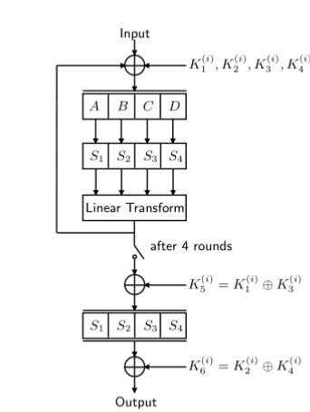
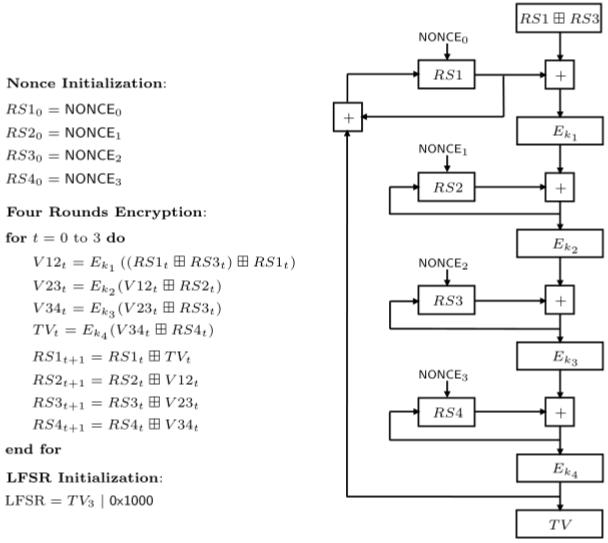
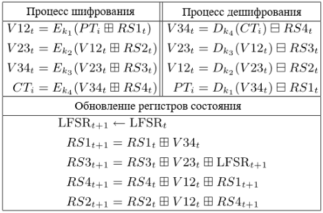

# Hummingbird

  В данной работе представлена HDL реализация алгоритма легковесного шифрования Hummingbird. Работа основана на работе Daniel Engels, Xinxin Fan, Guang Gong, Honggang Hu и Eric M. Smith «Ultra-Lightweight Cryptography for Low-Cost RFID Tags: Hummingbird Algorithm and Protocol».

  Проект реализован для платы De1-SoC и разработан в среде Quartus Prime Lite Edition 18.1. Больше информации по плате можно найти на сайте производителя [здесь](https://www.terasic.com.tw/cgi-bin/page/archive.pl?Language=English&CategoryNo=205&No=836&PartNo=4).

  Схематическое представление алгоритма шифрования Hummingbird.
 

  Модель представленна в виде разных модулей, каждый из которых выполняет свою собственную функцию:
- **encryption_function** - модуль, выполняющий функцию шифрования (Ek), обрабатывает блоки данных по 16 бит и выполняет операции наложения ключа функцией xor, табличной замены S-box и линейного преобразования linear_transform;

 

- **decryption_function** - схожий модуль, выполняющий обратное преобразование строки (функция дешифрования Dk);
- **linear_transform_enc** и **linear_transform_dec**- модули, выполняющие алгоритм линейного преобразования с использованием операций циклического сдвига и xor;
- **S_box** - множество модулей, представляющих из себя набор таблиц замены. Обрабатывают значения величиной по 4 бита;
- **encryption** - модуль, выполняющий полный цикл шифрования одного блока данных (PT to CT). На картинке выше представлен как Encryption Process. Представляет собой последовательность четырех модулей encryption_function с наложением значений регистров внутреннего состояния RS при помощи операции сложения по модулю 16;
- **decryption** - схожий модуль, выполняющий полный цикл дешифрования одного блока данных (CT to PT). На картинке выше представлен как Decryption Process. Представляет собой последовательность четырех модулей decryption_function с наложением значений регистров внутреннего состояния RS при помощи операции вычитания по модулю 16;
- **initial_process** - модуль необходимый для выполнения операции инициализации системы, в данном модуле происходит управление регистрами состояний, обработка сигналов начала и окончания процесса шифрования и дешифрования. Модуль представляет собой автомат Мили, каждое из состояний которого представляет собой определенный процесс обработки данных;

 
 

- **final_humming** - верхний файл проекта, связывающий все модули системы в единое целое. В данном модуле указаны связи между модулями и шины данных для взаимодействия с устройством из вне;

## Запуск и моделирование
  В данной ветке представлен проект для Quartus. Для его запуска и тестирования скачайте проект. В папке \project находится файл проекта Hummingbird.qpf. Его необходимо запустить с помощью среды разработки Quartus II. Для прототипирования на плате устаовите файл верхнего уровня DE1_SOC_golden_top и проведите компиляцию. Для симуляции лучше выбрать файлом верхнего уровня final_humming и провести Analysis&Elaboration, после чего с помощью файла Waveform1.vwf провести тестирование.

## Используемое ПО
- [Quartus Prime Lite Edition 18.1](https://fpgasoftware.intel.com/18.1/?edition=lite&platform=windows) с дополнительным пакетом ModelSim-Intel FPGA Edition и поддержкой необходимого устройства (в нашем случае Cyclone V device support).

## Документация
- Для знакомство со структурой и принципа шифрования алгоритма статья [здесь](https://uwaterloo.ca/communications-security-lab/publications/ultra-lightweight-cryptography-low-cost-rfid-tags)
- Текст ВКР с подробным описанием работы [здесь](source/ДвойнишниковНЕ_ВКР.pdf)
